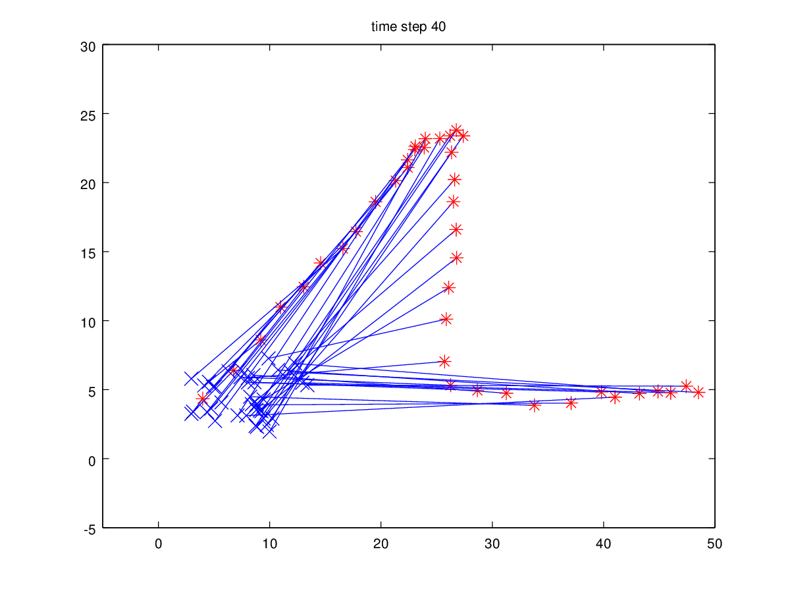
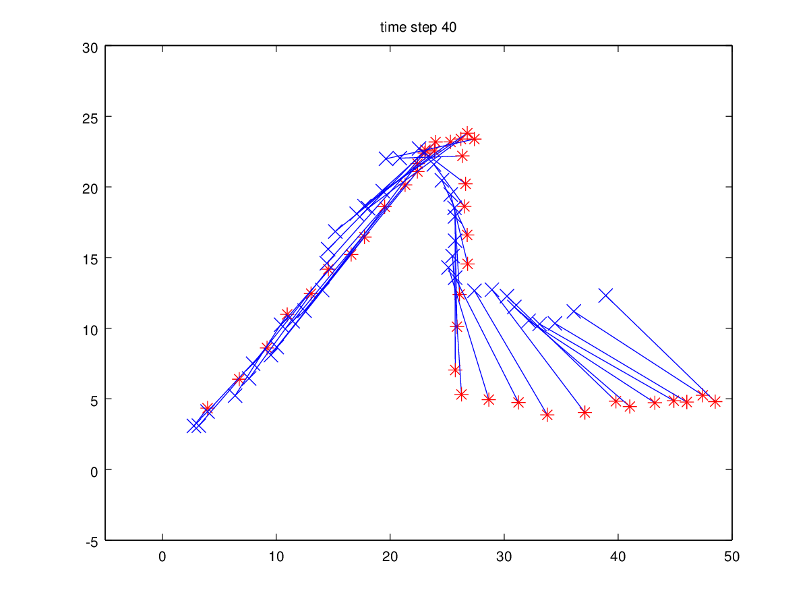
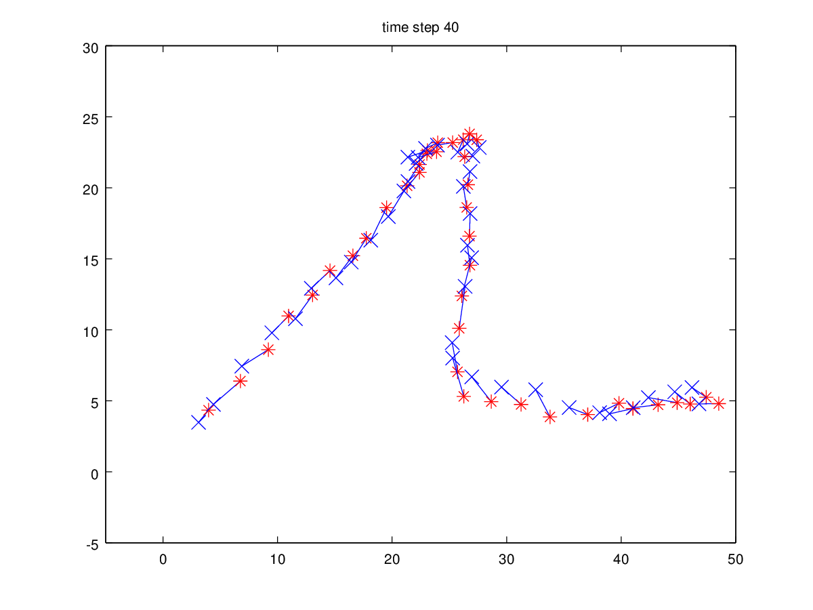
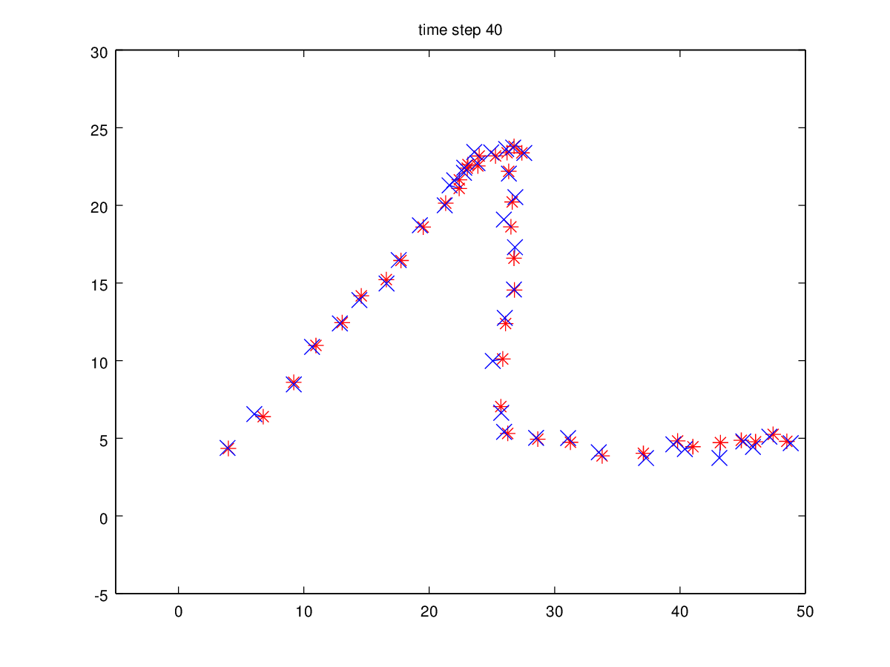
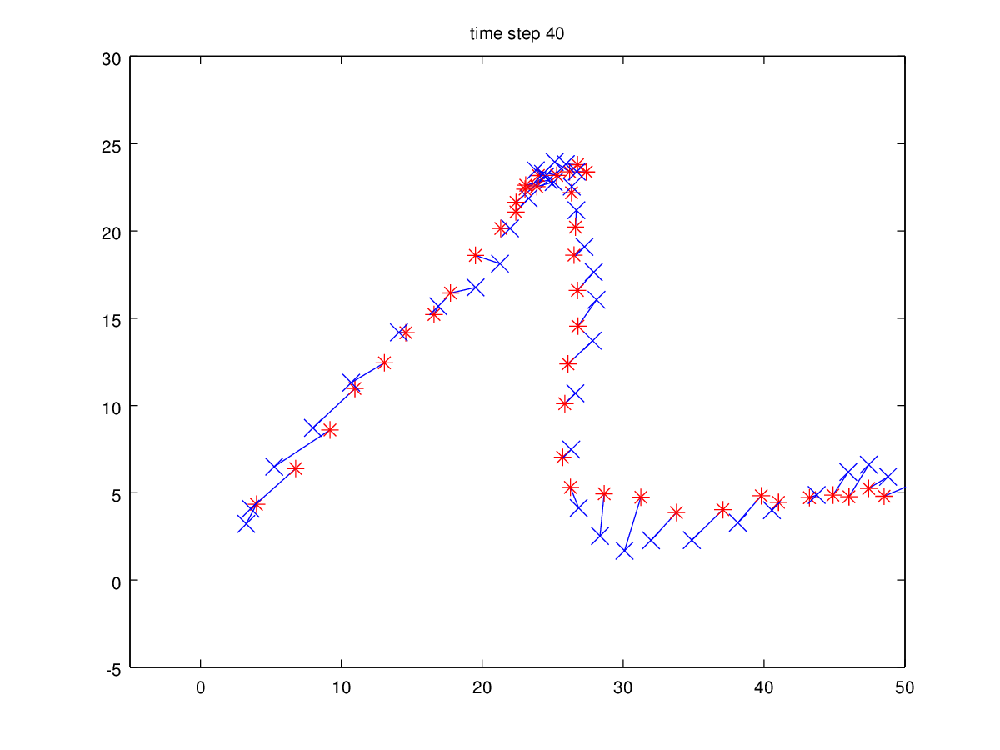
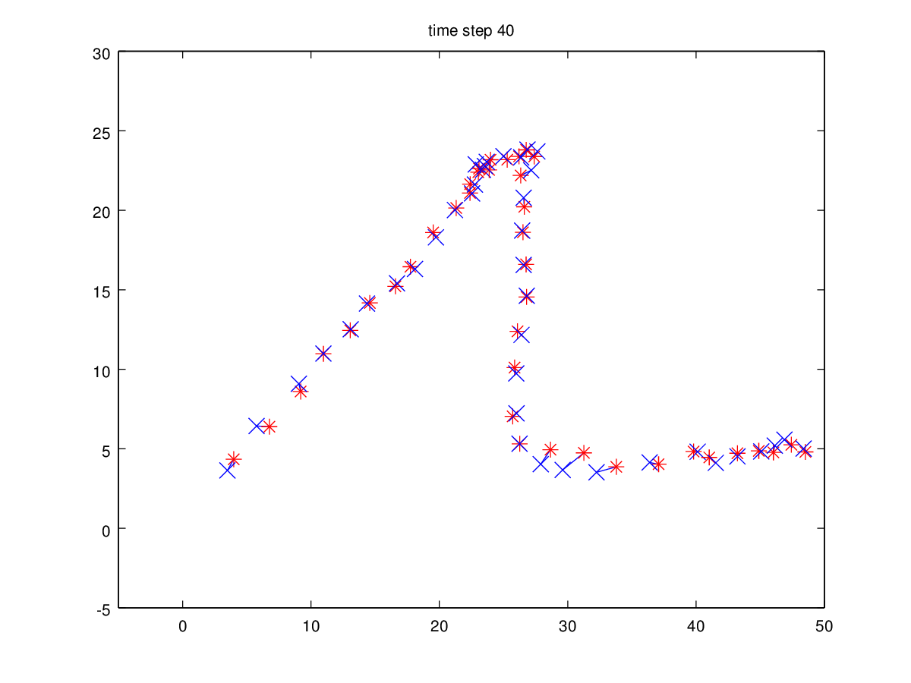
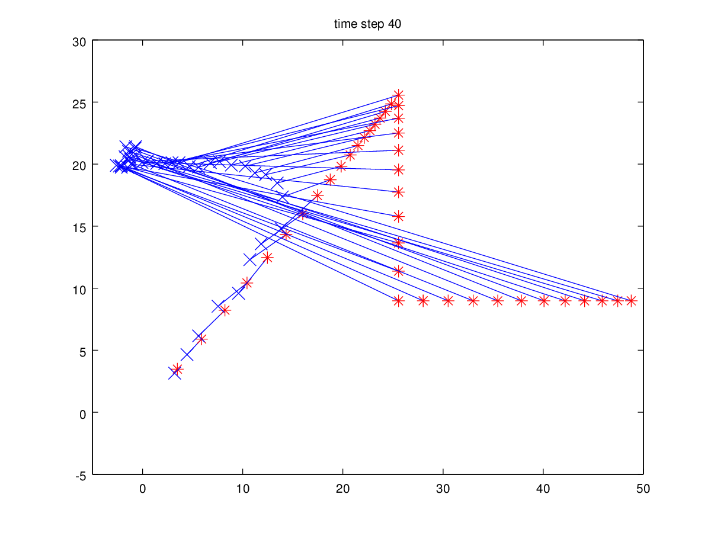
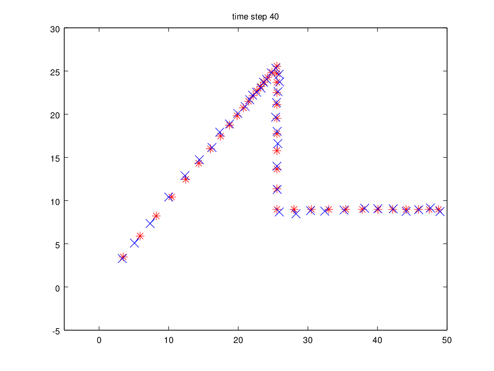
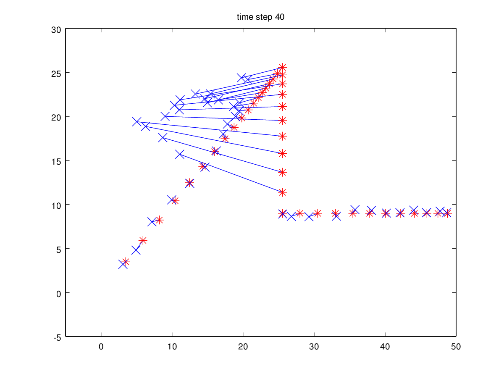

CPMS, Homework 4
================

-- *Weipeng He*

(a)
---

A sample result:

How are the particles positions evolving?
^^^^^^^^^^^^^^^^^^^^^^^^^^^^^^^^^^^^^^^^^

It can be observed that the particles are moving randomly around its previous position, which is actually defined by the system dynamics (i.e. constant position model).

What can you observe about the weights?
^^^^^^^^^^^^^^^^^^^^^^^^^^^^^^^^^^^^^^^

The weights of particles that are moving towards the observations are larger. After a few steps, (because of no resampling) the one particular particle has weight of almost one. All the rest has very small weight.

How good is the estimate?
^^^^^^^^^^^^^^^^^^^^^^^^^

It is hard to evaluate the estimate, since we don't know the ground truth. However, we can observe that:

* The estimate differs very much from the observations. This is because that the proposed dynamics may not correctly describe the real dynamics.
* The estimate differs very much from different runs. This is because there is no resampling step and there is not sufficient number of particles. As previously mentioned, only one particle will take all the weights and the estimate is then similar to the random walk of this particle.

Try with more samples
^^^^^^^^^^^^^^^^^^^^^

Use 200 particles, we can observe that:

* Same as previous results, after a few steps, one particle will take all the weights. However, it is also very likely that the weight will switch to another particle (if this particle moves even closer to the observation).
* The estimate is still very random.

To summarize, particle filter without resampling is as same as importance sampling (Note that it is not sequential). The samples are drawn from a very large space (i.e. 2 times the number of steps). Comparing to the large space, 20 or 200 samples are far from sufficient. Therefore, it is not likely to achieve a good estimate.

(b)
---

A sample result:

Apply resampling step to the filter, we can observe that:

* The weights of particles are more even.
* The estimate moves towards the observations slowly. The estimate is the combination of the dynamics and the observations.
* Overall, the tracking is indeed improved.

(c)
---

A sample result is shown below:

The parameter 'sigma x' is the standard deviation of the noise term in the proposed dynamics. It is proportional to how far the particle will randomly move for each step.

If we increase 'sigma x' to 3, the predicted positions of particles will be more scattered, also meaning that a larger search area will be used. Therefore, we can observe that the estimate follows the observation more closely.

(d)
---

A sample result is shown below:

The parameter 'sigma z' indicates how uncertain the observation is. Change it from 4 to 1 means the we trust more the observation. Then the particles that are away from the observation will be very unlikely. We can observe that the only a few among all the particles will have large weights and the rest are almost zero. And, the estimate is very close to the observation.

(e)
---

A sample result is shown below:

Again, it is not possible to justify which result is better since we don't know the ground truth. We can observe that the estimate follows closely to the observation when the observation moves at constant speed. However, when the observation abruptly changes it direction, the estimate continues to go at its previous velocity for a few step before it can turn to the observations.

(f)
---

A sample result is shown below:

Similarity to what we observe from (d), the estimate are all very close to observation.

(g)
---

A sample result of constant position model:

Using constant position dynamics fails (almost surely) to track the correct trajectory. It is because the dynamic does not sufficiently describe how real trajectory moves. Therefore, there is not enough information to tell which is a distractor or the original trajectory.

A sample result of constant velocity model that succeeded to track:

A sample result of constant velocity model that failed to track:

Whereas, using constant velocity dynamics will succeed most of the time. The dynamics give more accurate information about how real trajectory will move. Therefore, it is more probably to track the original trajectory since it move at constant velocity when the distractor appears.

