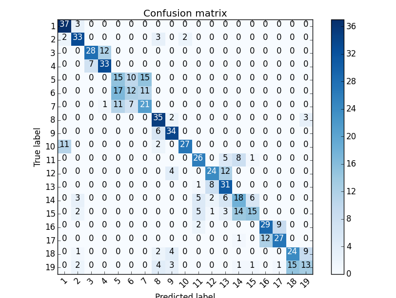
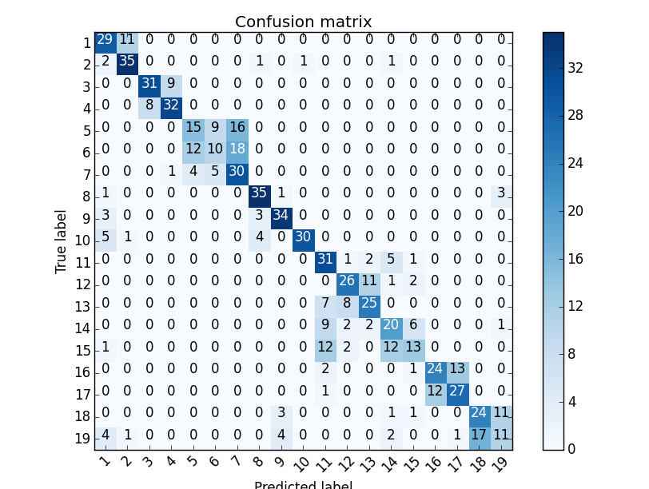
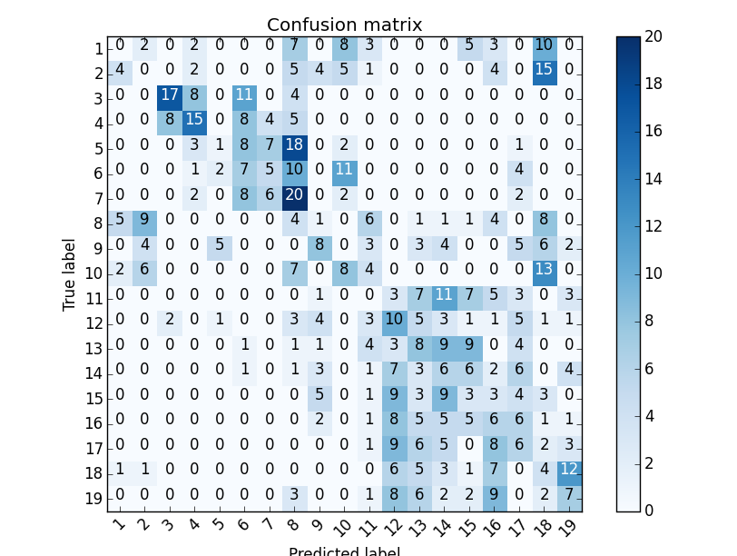

CPMS, Homework 6
================

-- *Weipeng He*

Implementation
--------------

For this homework, I used python as programming language. I used the library hmmlearn for training HMM.

However, the library is not well written and maintained. I spend some time to deal with the issues in the library, but I didn't solve everything. One prominent problem is that it does not handle cases where a state or a mixture has very small (or zero due to floating point underflow) posterior. Ideally, this could be solved by removing the not-likely state (mixture) and splitting the most likely state (mixture).

Preprocessing
-------------

I observed that most feature values are zero at the beginning of each sequence. Thus, I used only the features after the 30th frame of each sequence.

Approaches
----------

In this task, I tried three different appraoches, which are:

* GMM-HMM with ergodic transition
* GMM-HMM with left-right transition
* Discrete HMM with vector quantization

These approaches are presented as follows.

.. raw:: pdf

  PageBreak

GMM-HMM (ergodic transition)
----------------------------

I trained GMM-HMM model for each sign. The HMM models have ergodic transition matrix. The Gaussian mixtures have diagonal covariance matrix with a particular minimum value. For testing, the sign class is predicted by selecting the class (model) with the maximum likelihood.

I did experiments regarding trying different number of states/mixtures and selecting different features.

Features
^^^^^^^^

I tested the leave-one-subject-out cross validation accuracy of methods using different features. I used HMM with 3 states and 3 mixtures for this experiment.

The result is shown as follows:

================================= ============
**Features**                      **Accuracy**
--------------------------------- ------------
                              All 0.503
                Position/velocity **0.634**
Position/velocity + blob features 0.607
   Position/velocity + Hu moments 0.595
                       Hu moments 0.292
       Hu moments + blob features 0.400
                    blob features 0.417
================================= ============

Using only the position and velocity of both hands achieved the best performance. And its confusion matrix is shown as follows:

Number of states/mixtures
^^^^^^^^^^^^^^^^^^^^^^^^^

I tested the leave-one-subject-out cross validation accuracy of methods using different number of states and mixtures. I selected position and velocity as features.

The result is show as follows:

=========================== ========= ========= ======== ========
# of states | # of mixtures 1(Gauss.) 3         5        9
--------------------------- --------- --------- -------- --------
                    1 (GMM) 0.468     0.436     0.442    0.475
                          3 0.6       **0.634** 0.599    0.591
                          5 **0.634** 0.621     0.588
                          9 0.625     0.582    
=========================== ========= ========= ======== ========

Both 5-state Gaussian and 3-state 3-mixture GMM has the best performance. Below is the confusion matrix of 5-state Gaussian:

.. raw:: pdf

  PageBreak

GMM-HMM (left-right transition)
-------------------------------

As the second approach, I changed the connectivity of the HMM to left-to-right. The rest of remains the same.

Number of states/mixtures
^^^^^^^^^^^^^^^^^^^^^^^^^

I tested the leave-one-subject-out cross validation accuracy of methods using different number of states and mixtures. I selected position and velocity as features.

The result is show as follows:

=========================== ========= ======== ======== ========
# of states | # of mixtures 1(Gauss.) 3        5        9
--------------------------- --------- -------- -------- --------
                          3 0.596     0.628    0.6      0.582
                          5 0.616     0.609    0.571
                          9 **0.632** 0.571
=========================== ========= ======== ======== ========

The best result comes from HMM with 9 states and Gaussian emission probability.

.. raw:: pdf

  PageBreak

Discrete HMM
------------

In the third approach, I used Discrete HMM with K-means as quantization method. However, this method fails to achieve non-trivial accuracy.

I tried with many different parameter setting, and the best I can get is using 20 clusters for quantization, 3 states for HMM with position/velocity as features. The accurary is 0.153. Below is the confusion matrix:

Discussion
----------

Overall, GMM-HMM with ergodic transition achieved the best performance. Comparing the result with different features shows that, position and velocity of hands are the most reliable features.

By comparing the result of different number of states/mixtures, it showed that 3 states and 3 mixture components are enough. With more number of states/mixtures, it will result in overfitting.

Regarding the left-right HMM, at first, I expected that it would outperforms the ergodic HMM, since the signs are highly structured with start and end phases. However, the result is slightly worse than ergodic HMM. I think it might be due to the initialization which does not correctly separate the "phases". I also observed that some the of the training results degenerate to only one state (first state transit to itself with probability of one). This special case should be handled during training.

And, as for the discrete HMM, the problem is with the quantization. It is because that the number of data is limited comparing to the dimension of features. Which means that only a small space is covered by the samples. If I use small number of clusters, then there won't be enough information for training. While, if I choose a large number of clusters, there will be only a few samples in each clusters.

By using Gaussian distribution will not have the problem. It is because by setting a minimal covariance value (regularization), the distributions can properly cover the whole feature space.

