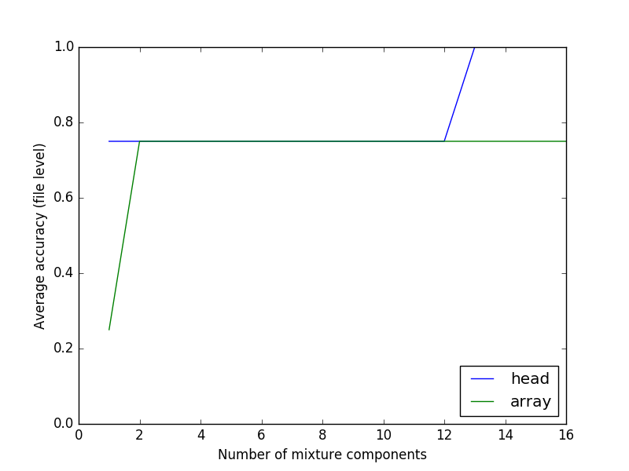
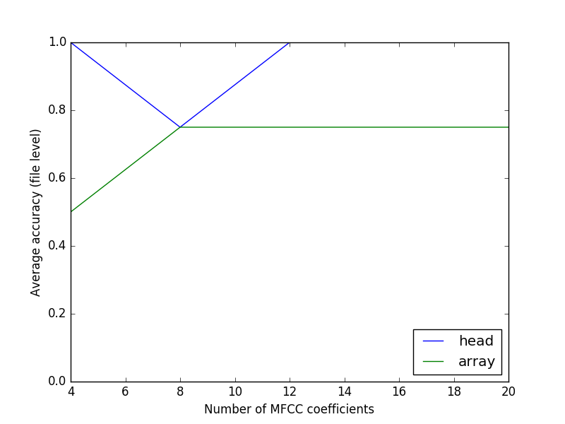

CPMS, Homework 3
================

-- *Weipeng He*

Part 1
------

The code for this part is in file ``part1.py``. I used the GMM implementation from scikit-learn library.

K = 3
^^^^^

The fitted model with 3 components has the following parameters::

  weights = [ 0.27106915  0.37991589  0.34901496]
  means =
  [[ 1.30897835  0.11929367]
   [ 1.69618826  2.03032176]
   [-0.17171217  0.51410805]]
  covs =
  [[[ 0.35693566  0.07843748]
    [ 0.07843748  0.76835218]]

   [[ 1.12586992  0.00768047]
    [ 0.00768047  0.88223556]]

   [[ 0.4948157   0.21581451]
    [ 0.21581451  1.31046836]]]

This plot shows the responsibility values of each data sample:

.. image:: resp.png
   :name: responsibility values
   :width: 70%

In the figure, we can see that the samples from the original three components are highly interleaved. The result of the estimated model does not successfully match the real parameters.

K = 2
^^^^^

The fitted model with 2 components has the following parameters::

  weights = [ 0.58302121  0.41697879]
  means =
  [[ 0.48029514  0.29912586]
   [ 1.581088    1.93948237]]
  covs =
  [[[ 0.99481106  0.07355668]
    [ 0.07355668  1.07683421]]

   [[ 1.21853911  0.03373835]
    [ 0.03373835  0.99413593]]]

K = 4
^^^^^

The fitted model with 4 components has the following parameters::

  weights = [ 0.25647404  0.19857104  0.28308459  0.26187034]
  means =
  [[ 1.37647623  0.20795541]
   [-0.31280652 -0.0844824 ]
   [ 0.28644038  1.31519666]
   [ 2.16633722  2.1928731 ]]
  covs =
  [[[ 0.30001452  0.06270939]
    [ 0.06270939  0.85948487]]

   [[ 0.48937527  0.15162373]
    [ 0.15162373  1.00614215]]

   [[ 0.57092188 -0.09147207]
    [-0.09147207  0.92495559]]

   [[ 0.65558056 -0.11548725]
    [-0.11548725  0.8383102 ]]]

.. raw:: pdf

   PageBreak

Part 2.1 Dataset1
-----------------

The code for this part is in file ``part2_1.py``.

(a)
^^^

Estimate GMM model parameters for each speaker (*j*) using training set:

.. math::

  \theta^j

The rule to identity speaker at frame level is:

.. math::

  arg\,max_{j}P(X|\theta^j)

(b)
^^^

And, at utterance level is:

.. math::

  arg\,max_{j}\prod_{i}P(X_i|\theta^j) = arg\,max_{j}\sum_{i}\log P(X_i|\theta^j)

(c)
^^^

Use 16 MFCC (first 17 coefficients except energy) calculated with frame size of 32ms and frame rate of 100fps as feature vector, initialize with K-means clustering, train GMM models with 2 components and diagonal covariance matrices. The accuracy at frame level and at utterance level for each person is listed as follows:

============ ===== ===== ===== ===== ===== ===== ===== =====
Person       0     1     2     3     4     5     6     7
------------ ----- ----- ----- ----- ----- ----- ----- -----
ACC (frame)  0.418 0.327 0.234 0.323 0.484 0.568 0.386 0.223
ACC (utter.) 1.0   1.0   0.0   0.0   1.0   1.0   1.0   1.0
============ ===== ===== ===== ===== ===== ===== ===== =====

Note that each run of the experiment has different results. This is due the randomization of at the initialization step and also because the training and test set is small.

(d)
^^^

Changing number of components from 1 to 4, the results is shown as follows:

============ ===== ===== ===== =====
K            1     2     3     4
------------ ----- ----- ----- -----
ACC (frame)  0.346 0.371 0.393 0.385
ACC (utter.) 0.75  0.75  0.75  0.75
============ ===== ===== ===== =====

From the table we can see that at frame level when using 3 mixture components the performance is the best. And at utterance level, they all have 6 speakers correctly identified. Note that each run of the experiment has different results. Theoretically, models with low number of components fail to approximate the real distribution, while models with large number of components approximate the training data too close and may result in overfitting.

(e)
^^^

Use 3 mixture components. Changing number of coefficients used to 4, 8, 12 and 16, the results are shown as follows:

============ ===== ===== ===== =====
# of coeff.  4     8     12    16
------------ ----- ----- ----- -----
ACC (frame)  0.217 0.287 0.298 0.367
ACC (utter.) 0.25  0.375 0.875 0.75
============ ===== ===== ===== =====

The results show that the best when using 16 or 12 coefficients, the performance is the best at frame level or at utterance level. Fewer number of coefficients contains less information to characterize the speaker's voice. And the coefficients with large indices are the high frequency cepstrums that might contain noise.

.. raw:: pdf

   PageBreak

Part 2.2 Dataset2
-----------------

The code for this part is in file ``part2_2.py``.

(a)
^^^

Use 20 MFCC (first 21 coefficients except energy) calculated with frame size of 32ms and frame rate of 100fps as feature vector, initialize with K-means clustering, train GMM models with 16 components and diagonal covariance matrices.

The following table shows the accuracy at different levels for each person and for both head test set and array test set.

+----------+-----------------+-------+-------+-------+-------+
| Test set | Person          | 1     | 2     | 3     | 4     |
+==========+=================+=======+=======+=======+=======+
| Head     | ACC (frame)     | 0.566 | 0.682 | 0.363 | 0.527 |
|          +-----------------+-------+-------+-------+-------+
|          | ACC (20 frames) | 0.703 | 0.894 | 0.445 | 0.736 |
|          +-----------------+-------+-------+-------+-------+
|          | ACC (file)      | 1.0   | 1.0   | 1.0   | 1.0   |
+----------+-----------------+-------+-------+-------+-------+
| Array    | ACC (frame)     | 0.421 | 0.487 | 0.188 | 0.358 |
|          +-----------------+-------+-------+-------+-------+
|          | ACC (20 frames) | 0.475 | 0.621 | 0.154 | 0.5   |
|          +-----------------+-------+-------+-------+-------+
|          | ACC (file)      | 1.0   | 1.0   | 0.0   | 1.0   |
+----------+-----------------+-------+-------+-------+-------+

The result shows that the accuracy per every 20 frames or for the whole file are higher than the accuracy at frame level. It is because more frames contains more information and the effects of noises are reduced.

(b)
^^^

The average accuracy (at file level) of using different number of mixture components is shown below:

It shows that models more mixture components have better ability to approximate the real distribution thus have better performance.

(c)
^^^

The average accuracy (at file level) of using different number of MFCC coefficients is shown below:

It shows that methods using more than 12 MFCC coefficients achieve the best results.

(d)
^^^

Compared to the previous dataset, this dataset contains many more data. Therefore, it is possible to learn complex models (more mixture components) without overfitting.

(e)
^^^

The headset recording is closer to the speakers' mouths, therefore the head test dataset is cleaner. Furthermore, the speaker models are trained on such dataset. So, the performance on the head test dataset is better than that on the array test dataset.

