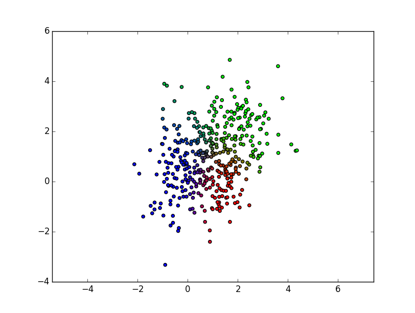

CPMS, Homework 3
================

Part 1
------

The code for this part is in file ``part1.py``. I used the GMM implementation from scikit-learn library.

K = 3
^^^^^

The fitted model with 3 components has the following parameters::

  weights = [ 0.27106915  0.37991589  0.34901496]
  means = 
  [[ 1.30897835  0.11929367]
   [ 1.69618826  2.03032176]
   [-0.17171217  0.51410805]]
  covs = 
  [[[ 0.35693566  0.07843748]
    [ 0.07843748  0.76835218]]

   [[ 1.12586992  0.00768047]
    [ 0.00768047  0.88223556]]

   [[ 0.4948157   0.21581451]
    [ 0.21581451  1.31046836]]]

This plot shows the responsibility values of each data sample:

In the figure, we can see that the samples from the original three components are highly interleaved. The result of the estimated model does not successfully match the real parameters.

K = 2
^^^^^

The fitted model with 2 components has the following parameters::

  weights = [ 0.58302121  0.41697879]
  means = 
  [[ 0.48029514  0.29912586]
   [ 1.581088    1.93948237]]
  covs = 
  [[[ 0.99481106  0.07355668]
    [ 0.07355668  1.07683421]]

   [[ 1.21853911  0.03373835]
    [ 0.03373835  0.99413593]]]

K = 4
^^^^^

The fitted model with 4 components has the following parameters::

  weights = [ 0.25647404  0.19857104  0.28308459  0.26187034]
  means = 
  [[ 1.37647623  0.20795541]
   [-0.31280652 -0.0844824 ]
   [ 0.28644038  1.31519666]
   [ 2.16633722  2.1928731 ]]
  covs = 
  [[[ 0.30001452  0.06270939]
    [ 0.06270939  0.85948487]]

   [[ 0.48937527  0.15162373]
    [ 0.15162373  1.00614215]]

   [[ 0.57092188 -0.09147207]
    [-0.09147207  0.92495559]]

   [[ 0.65558056 -0.11548725]
    [-0.11548725  0.8383102 ]]]

